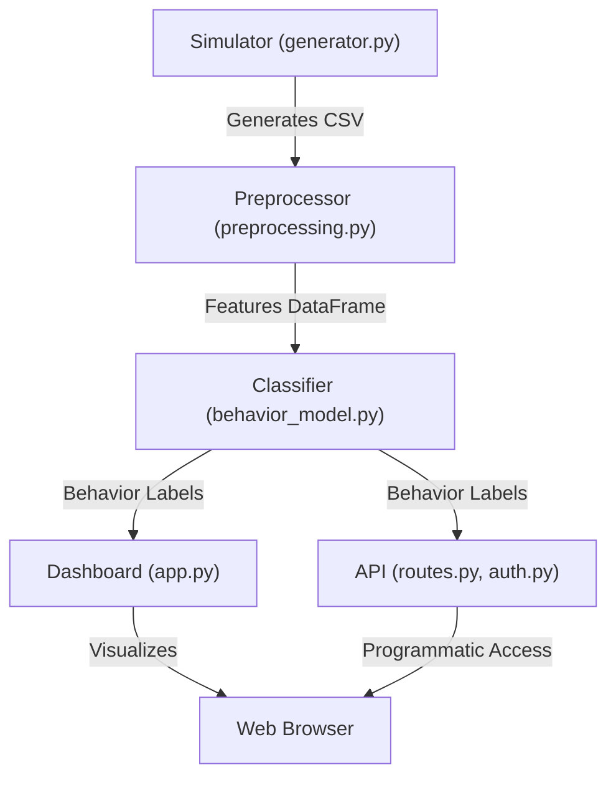

# Wildlife Movement Profiler – Technical Walkthrough

## 1. Introduction & Context

The Wildlife Movement Profiler is a modular Python system for simulating, processing, and analyzing wildlife telemetry data. It is designed for research and prototyping in computational ecology, behavioral analysis, and sensor data pipelines. The project demonstrates end-to-end data flow: from synthetic data generation to feature engineering, behavioral state classification, and interactive visualization via a web dashboard.

---

## 2. Architecture Overview

The system is architected as a data pipeline with clear separation of concerns. Each stage is independently testable and replaceable, supporting both rapid prototyping and future scaling. Below is a high-level architecture diagram:



- **Simulator**: Parameterized stochastic process for generating multi-modal telemetry (GPS, accelerometer, etc.).
- **Preprocessor**: Cleans, normalizes, and extracts engineered features (e.g., speed, heading, acceleration magnitude).
- **Classifier**: Supports both rule-based and supervised ML (Random Forest) approaches for behavioral state inference.
- **Dashboard/API**: Exposes results via a FastAPI web dashboard and RESTful endpoints, with JWT-based authentication.

---

## 3. File-by-File Code Walkthrough

- **simulator/generator.py**  
  Implements a configurable simulator for wildlife telemetry. Uses random walks and parametric noise to emulate animal movement and sensor readings. Outputs a time-indexed CSV.

- **processor/preprocessing.py**  
  Handles data ingestion, missing value imputation, normalization, smoothing (moving average, Savitzky-Golay), and feature extraction. Designed for extensibility (e.g., additional filters or features).

- **classifier/behavior_model.py**  
  Provides both interpretable rule-based logic and a Random Forest classifier (via scikit-learn). Includes model training, persistence (joblib), and prediction. Feature selection is modular.

- **dashboard/app.py**  
  FastAPI app serving a web dashboard. Integrates Plotly for interactive visualizations (GPS tracks, behavioral timelines, sensor trends). When run, it auto-launches in the browser for optimal UX.

- **api/routes.py & api/auth.py**  
  RESTful API endpoints for telemetry, simulation, and classification. Implements JWT authentication for secure, stateless access. Designed for easy extension (e.g., user roles, additional endpoints).

- **main.py**  
  Minimal entry point for project initialization.

- **tests/test_pipeline.py**  
  Unit and integration tests for the simulation, preprocessing, and classification pipeline. Ensures correctness and regression safety.

- **requirements.txt**  
  Explicit dependency specification for reproducibility.

- **usage_and_comments.md**  
  Comprehensive usage guide with copy-paste terminal commands and project structure overview.

---

## 4. Demo Steps

1. **Install dependencies**
   ```sh
   pip install -r Wildlife-Movement-Profiler-main/Wildlife-Movement-Profiler-main/requirements.txt
   ```

2. **Simulate telemetry data**
   ```sh
   python Wildlife-Movement-Profiler-main/Wildlife-Movement-Profiler-main/simulator/generator.py
   ```

3. **Preprocess the data**
   ```sh
   python Wildlife-Movement-Profiler-main/Wildlife-Movement-Profiler-main/processor/preprocessing.py
   ```

4. **Classify behaviors**
   ```sh
   python Wildlife-Movement-Profiler-main/Wildlife-Movement-Profiler-main/classifier/behavior_model.py
   ```

5. **Launch the dashboard**
   ```sh
   python Wildlife-Movement-Profiler-main/Wildlife-Movement-Profiler-main/dashboard/app.py
   ```
   The dashboard will open automatically in your browser.

6. **(Optional) Run tests**
   ```sh
   pytest Wildlife-Movement-Profiler-main/Wildlife-Movement-Profiler-main/tests/test_pipeline.py
   ```

---

## 5. Justification of Technology Choices

- **Python**: Ubiquitous in scientific computing, with mature libraries for simulation, data processing, and ML.
- **FastAPI (with Flask-like simplicity)**: Modern, async-ready, and type-annotated web framework. Enables rapid prototyping and production-readiness.
- **Pandas/Numpy/Scikit-learn**: De facto standards for data wrangling and machine learning in Python.
- **Plotly**: Enables interactive, publication-quality visualizations directly in the browser.
- **JWT Auth**: Secure, stateless authentication suitable for both web and API clients.
- **Modular, Testable Design**: Each component is independently testable, supporting both research and engineering best practices.

---

## 6. Challenges & Lessons Learned

- **Synthetic Data Realism**: Designing a simulator that is both simple and biologically plausible required careful parameterization and validation.
- **Feature Engineering**: Extracting robust, informative features from noisy, multi-modal sensor data is non-trivial and domain-dependent.
- **ML Model Generalization**: Ensuring that models trained on synthetic data can generalize to real-world telemetry is an open research challenge.
- **Web Integration**: Achieving a seamless, user-friendly dashboard experience (auto-launch, real-time updates) required careful orchestration between backend and frontend.
- **Testing**: Building a comprehensive test suite for a multi-stage, data-driven pipeline was essential for reliability and future extensibility.

---

## 7. Future Extension Ideas

- **Real Data Integration**: Ingest and process real telemetry from GPS collars, biologgers, or IoT devices.
- **Advanced ML Models**: Integrate deep learning (e.g., LSTMs, CNNs) for more nuanced behavioral state classification.
- **User Management**: Implement granular roles, permissions, and user-specific dashboards.
- **Geospatial Analysis**: Integrate with GIS tools and spatial databases for habitat and movement ecology studies.
- **Mobile App**: Enable real-time field data access, annotation, and feedback.
- **Cloud/Distributed Deployment**: Scale to large datasets and multi-user scenarios using cloud-native technologies.

---

## 8. Closing Statement

The Wildlife Movement Profiler exemplifies modular, reproducible, and extensible scientific software engineering. Its architecture supports both rapid prototyping and future scaling, making it a robust foundation for computational ecology research and applied conservation technology. 