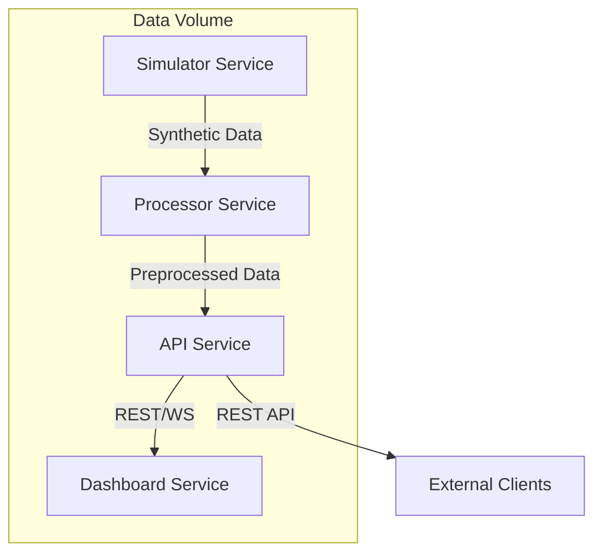

# Wildlife Movement Profiler

## Overview
Wildlife Movement Profiler is a modular platform for simulating, processing, classifying, and visualizing wildlife telemetry data. It supports research, conservation, and analytics by providing realistic synthetic data, advanced preprocessing, behavior classification, and interactive dashboards.

## Goals
- Enable rapid prototyping and testing of wildlife telemetry analytics
- Support both rule-based and ML-based behavior classification
- Provide real-time and historical data visualization
- Facilitate reproducible research and collaboration

## Architecture


## Setup Instructions
### Prerequisites
- Docker & Docker Compose
- (Optional) Python 3.10+ for local development

### Quick Start (Docker Compose)
```sh
git clone <repo-url>
cd Wildlife\ Movement\ Profiler
docker-compose up --build
```
- Dashboard: http://localhost:8050
- API: http://localhost:8000/docs

### Local Development
1. Install dependencies: `pip install -r requirements.txt`
2. Run simulator: `python simulator/generator.py`
3. Preprocess data: `python -c 'from processor.preprocessing import preprocess; preprocess("simulated_telemetry.csv")'`
4. Start API: `uvicorn api.main:app --reload`
5. Start dashboard: `uvicorn dashboard.app:app --reload --port 8050`

## Usage Examples
- Generate synthetic telemetry: see `simulator/generator.py`
- Preprocess and extract features: see `processor/preprocessing.py`
- Classify behaviors: see `classifier/behavior_model.py`
- Access REST API: see `api/routes.py` and `/docs`
- Visualize data: open the dashboard in your browser

## Contribution Guidelines
- Fork the repo and create feature branches
- Write clear commit messages and tests
- Follow PEP8 and project code style
- Open pull requests for review

## License
MIT License. See `LICENSE` file.

## Citation
If you use this platform in your research, please cite:
```
@software{wildlife_movement_profiler,
  title = {Wildlife Movement Profiler},
  author = {Your Name},
  year = {2024},
  url = {https://github.com/your-repo/wildlife-movement-profiler}
}
``` 